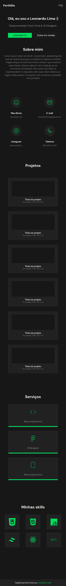
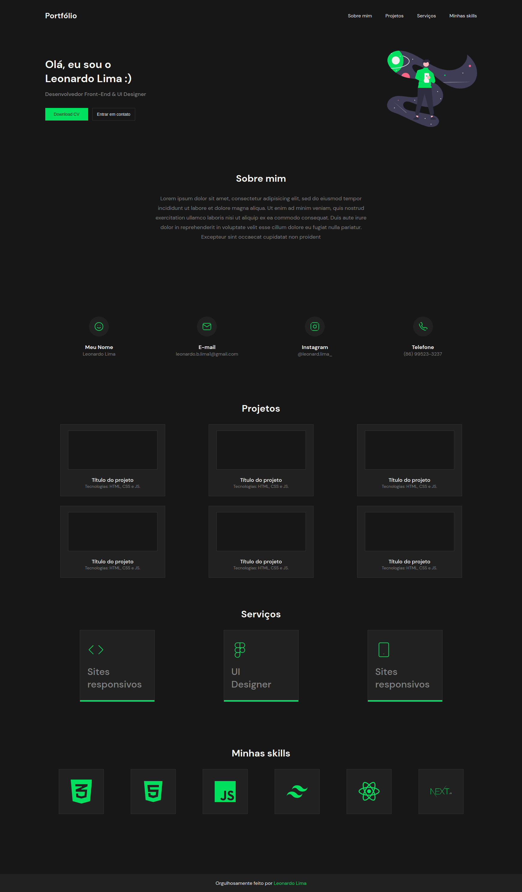

# Iuri code teste 009

Desafio simples de design resposivo Iuri Code 002 

## Referência

 - [Figma do projeto](https://www.figma.com/file/Yb9IBH56g7T1hdIyZ3BMNO/Desafios---Codel%C3%A2ndia?node-id=13190-3&t=J25Y5e5LAfqvIWFP-0)
 

## Screenshots

 

 |  | 
  |

 

## 🛠 Habilidades

HTML, CSS, Javascript, Typescript, ReactJs, Styled-components

